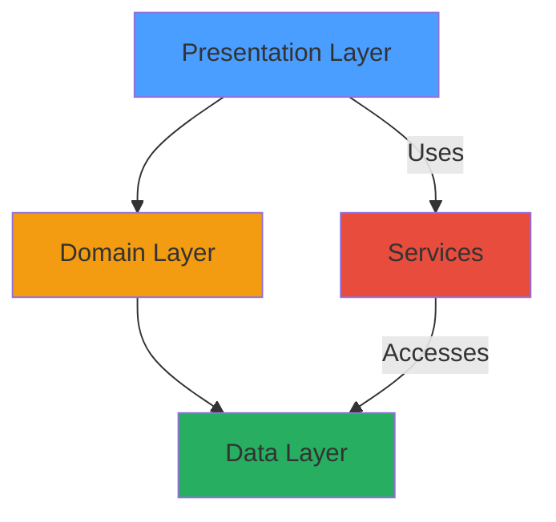
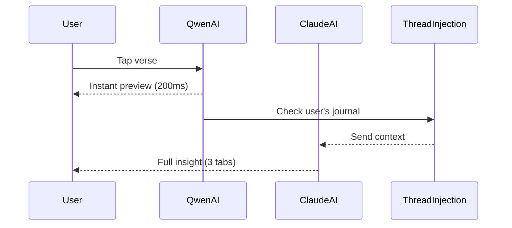
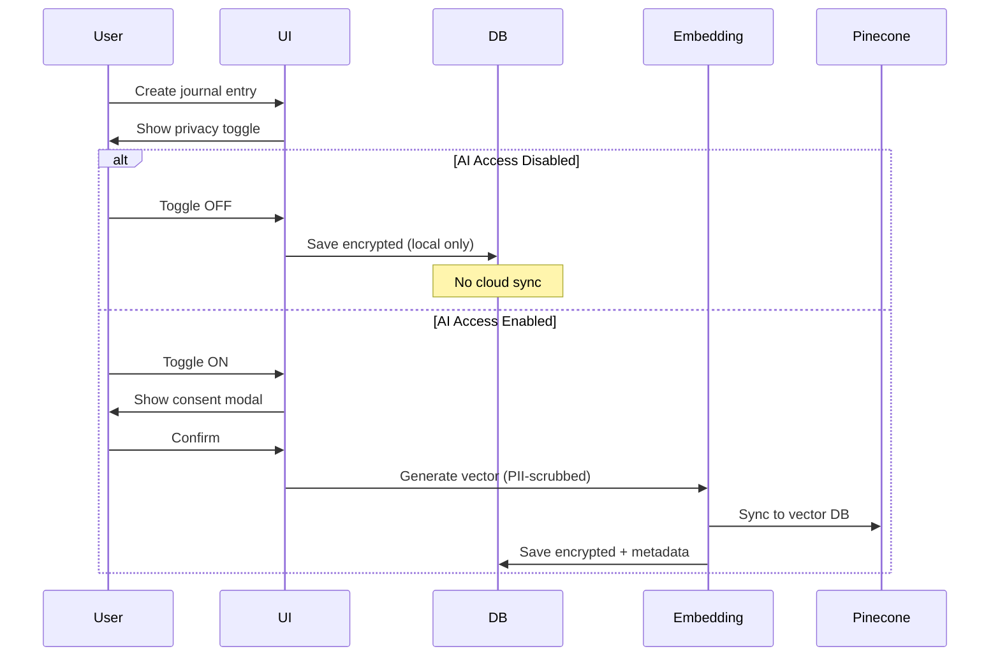
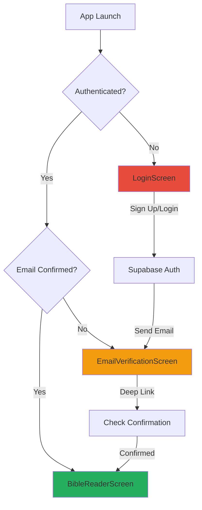
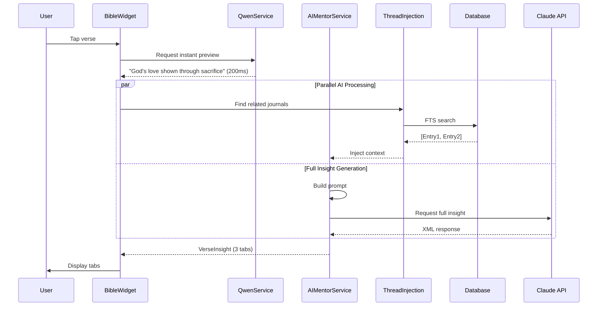
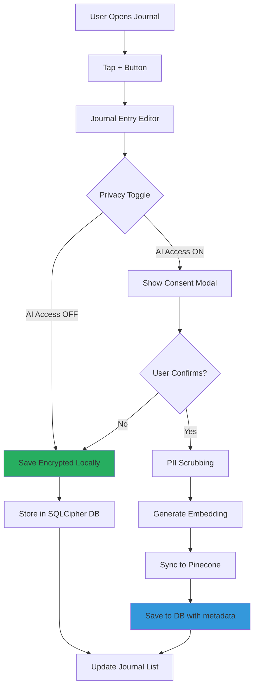
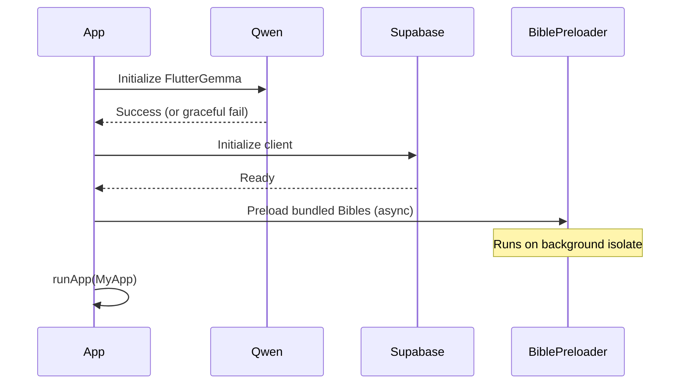

# ScriptureLens AI - Comprehensive App Architecture & Workflow Analysis

## 📱 App Overview

**ScriptureLens AI** is a Flutter-based biblical study and spiritual growth application that combines:
- Privacy-first encrypted journaling
- On-device AI (Qwen 2.5 0.5B) + Cloud AI (Claude/Anthropic)
- Theological mentorship following Discovery Bible Study (DBS) methodology
- Archaeological discoveries and historical context
- Vector memory for personalized insights

---

## 🏗️ Architecture Overview

### Clean Architecture Layers

The app follows a strict **Clean Architecture** pattern:



#### 1. **Presentation Layer** (`lib/features/*/presentation/`)
- Screens (UI)
- Widgets (Reusable components)
- State providers (Riverpod)

#### 2. **Domain Layer** (`lib/features/*/domain/`)
- Business logic
- Models
- Use cases

#### 3. **Data Layer** (`lib/features/*/data/`)
- Repositories
- Data sources (local DB, API)

#### 4. **Services** (`lib/services/`)
- Cross-cutting concerns (AI, auth, caching)
- Preloading services

---

## 📐 Navigation Structure

The app uses a **bottom navigation bar** with `IndexedStack` to preserve state across tabs:

````carousel

```mermaid
graph LR
    A[BibleReaderScreen] --> B[Home]
    A --> C[Discover]
    A --> D[Read]
    A --> E[Journal]
    A --> F[Mentor]
    A --> G[Me]
    
    style A fill:#2c3e50
    style B fill:#3498db
    style C fill:#9b59b6
    style D fill:#e67e22
    style E fill:#16a085
    style F fill:#e74c3c
    style G fill:#f39c12
```


<!-- slide -->

| Tab Index | Screen | Purpose |
|-----------|--------|---------|
| 0 | **Home Dashboard** | Daily insights, AI follow-ups, stuck detection |
| 1 | **Discover** | Archaeological findings, biblical timeline, videos |
| 2 | **Read (Bible)** | Bible reader with AI mentor panel |
| 3 | **Journal** | Encrypted reflections with Look Forward notes |
| 4 | **Mentor Hub** | DBS sessions (Look Back/Up/Forward) |
| 5 | **Me (Profile)** | Soul Sphere, growth tracks, prayer altar |
````

---

## 🎯 Feature Deep Dive

### 1. 🏠 Home Screen

**File**: [home_screen.dart](file:///Users/erickgitaranga/scripture_lens%20AI/lib/features/home/presentation/home_screen.dart)

#### Components

##### Pulse Header
- Displays user's spiritual "pulse" (average emotion over last 7 days)
- Visual representation using color gradients

##### Daily Fact Card
- Curated biblical facts from discovery feed service

##### AI Follow-Up Card
- AI-generated empathetic question based on recent journal entries
- Uses **Qwen** (on-device) for instant response, falls back to Claude

##### Stuck Detector Card
- Monitors if user is "stuck" on a passage for 3+ days
- Offers context breakthroughs using AI

##### Daily Prayer Card
- Generates personalized prayers based on user's current emotional state
- Uses prayer service with theme-based prompts

---

### 2. 🔍 Discover Screen

**File**: [discover_screen.dart](file:///Users/erickgitaranga/scripture_lens%20AI/lib/features/discover/presentation/discover_screen.dart)

#### Features

##### Archaeological Discoveries Grid
- **Dead Sea Scrolls**, **Hezekiah's Tunnel**, **Pool of Siloam**, etc.
- Each discovery shows:
  - Image
  - Biblical connection
  - Era (with color-coding)
  - AI-generated context bridge

##### Chronological Context Slider
- Biblical timeline with visual eras:
  - Patriarchs (2000 BC)
  - Exodus (1400 BC)
  - Kingdom Era (1000 BC)
  - Exile (586 BC)
  - New Testament (0-100 AD)

##### DBS (Discovery Bible Study) Module
- Study method prompts:
  - "What did you notice?"
  - "What does this reveal about God?"
  - "How will you respond?"

##### Unifying Thread Visualizer
- Shows how OT shadows connect to NT fulfillment
- Interactive parallels (e.g., Passover Lamb → Jesus)

##### Video Content Feed
- Curated theological videos
- "LIVE" badge for trending content

---

### 3. 📖 Bible Reader (Read Tab)

**File**: [bible_content_widget.dart](file:///Users/erickgitaranga/scripture_lens%20AI/lib/features/bible/presentation/widgets/bible_content_widget.dart)

#### Core Components

##### Bible Content Widget
- Book & Chapter selector with haptic feedback
- Verse-by-verse rendering with tap-to-select
- **Chronological slider** at bottom to show historical era

##### AI Mentor Panel
**File**: [ai_mentor_panel.dart](file:///Users/erickgitaranga/scripture_lens%20AI/lib/features/bible/presentation/widgets/ai_mentor_panel.dart)

**Three Tabs: Meaning, Apply, Related**



###### Tab 1: Meaning
- **Natural Translation**: Original language nuances (Greek/Hebrew)
- **Original Context**: Historical/cultural background

###### Tab 2: Apply
- **So What?**: Modern life application
- **Scenario**: Practical example (work, relationships, mental health)

###### Tab 3: Related
- **Threads**: User's past journal entries related to this theme
- Personalized insight: "You felt [Emotion] on [Date]; this verse offers [Comfort/Challenge]"

##### Quick Reflection Input
- Inline journal entry creation
- Auto-attached to current verse

##### Bridge Toggle
- Switch between "Scholar Mode" (depth) and "Applied Mode" (practical)

---

### 4. 📝 Journal Screen

**File**: [journal_screen.dart](file:///Users/erickgitaranga/scripture_lens%20AI/lib/features/journal/presentation/journal_screen.dart)

#### Features

##### Entry List
- Chronological feed of all journal entries
- Each card shows:
  - Emotion tag (with color-coded pulse)
  - Date & time
  - Content preview
  - Attached verse reference (if any)
  - Look Forward notes (expandable)

##### Look Forward Notes
- AI-generated follow-up question for next reflection
- JSON structure stored in database:

```json
{
  "question": "How did this insight change your day?",
  "verses": ["John 3:16", "Romans 8:28"]
}
```

##### Spiritual Pulse Dashboard
**Widget**: [spiritual_pulse_dashboard.dart](file:///Users/erickgitaranga/scripture_lens%20AI/lib/features/journal/presentation/widgets/spiritual_pulse_dashboard.dart)

- 7-day emotion timeline
- Average pulse visualization

##### Journal Entry Editor
**Widget**: [journal_entry_editor.dart](file:///Users/erickgitaranga/scripture_lens%20AI/lib/features/journal/presentation/widgets/journal_entry_editor.dart)

- **Privacy Toggle**: `ai_access_enabled` boolean
  - If `false`: Entry encrypted locally, no AI access
  - If `true`: Entry sent to vector memory (PII-scrubbed)

---

### 5. 💬 Mentor Hub Screen

**File**: [mentor_hub_screen.dart](file:///Users/erickgitaranga/scripture_lens%20AI/lib/features/mentor/presentation/mentor_hub_screen.dart)

#### Discovery Bible Study (DBS) Methodology

The app implements **DBS** with three phases:

##### Look Back 🔙
- Review past journal reflections
- Identify recurring themes
- Show what verse/topic you explored before

##### Look Up 🔼
- Current Scripture study
- AI-generated thematic insights
- Verse suggestions based on user's chosen theme

##### Look Forward 🔜
- AI-generated reflection question
- Quick prayer generation
- Journal editor with pre-filled context

#### Mentorship Session Screen
**File**: [mentorship_session_screen.dart](file:///Users/erickgitaranga/scripture_lens%20AI/lib/features/mentor/presentation/mentorship_session_screen.dart)

**Features**:
- **Theme Selection**: Choose a spiritual theme (faith, fear, love, etc.)
- **Verse Discovery**: AI suggests 3-5 related verses
- **Deep Dive**: Tap verse to see full context in modal
- **Prayer Generator**: Creates personalized prayer based on theme

---

### 6. 👤 Me Screen (Profile)

**File**: [me_screen.dart](file:///Users/erickgitaranga/scripture_lens%20AI/lib/features/me/presentation/me_screen.dart)

#### Visual Components

##### Soul Sphere Widget
**File**: [soul_sphere_widget.dart](file:///Users/erickgitaranga/scripture_lens%20AI/lib/features/me/presentation/widgets/soul_sphere_widget.dart)

- 3D rotating sphere representing spiritual state
- Color shifts based on current pulse:
  - **High (4-5)**: Glowing cyan/blue
  - **Mid (2.5-4)**: Purple/pink
  - **Low (1-2.5)**: Warm orange/amber

##### Memory Nodes Overlay
**File**: [memory_nodes_overlay.dart](file:///Users/erickgitaranga/scripture_lens%20AI/lib/features/me/presentation/widgets/memory_nodes_overlay.dart)

- Floating bubbles representing journal entries
- Tap to revisit a memory

##### Growth Track Cards
**File**: [growth_track_card.dart](file:///Users/erickgitaranga/scripture_lens%20AI/lib/features/me/presentation/widgets/growth_track_card.dart)

- Shows spiritual themes user is exploring
- Status: **Blooming** (3+ mentions), **Rooting** (2), **Pruning** (1)

##### Legacy Altar
- Count of answered prayers
- Displays as a monument-style card

##### Profile Header
- User name: "Friend"
- Streak counter with flame icon

---

### 7. 🔎 Search Screen

**File**: [search_screen.dart](file:///Users/erickgitaranga/scripture_lens%20AI/lib/features/search/presentation/search_screen.dart)

#### Smart Search Features

##### Fuzzy Verse Search
- Handles typos using wildcard OR conditions
- Database: `AppDatabase.searchVersesFuzzy()`

##### AI-Powered Keyword Extraction
- User enters feeling/phrase: "I feel anxious about work"
- AI extracts keywords: `["anxiety", "work", "stress", "worry"]`

##### Smart Suggestions
- Popular topics: "Faith in hard times", "Forgiveness"
- Popular feelings: "Anxious", "Grateful", "Lonely"

##### Journal Entry Search
- FTS5 (Full-Text Search) on journal content
- Privacy-aware: only searches locally encrypted data

---

## 🔐 Privacy & Security Architecture

### Database Encryption

**File**: [app_database.dart](file:///Users/erickgitaranga/scripture_lens%20AI/lib/core/database/app_database.dart)

#### SQLCipher Encryption
```dart
database.execute('PRAGMA key = "$key"')
```

- AES-256 encryption
- Key stored in `FlutterSecureStorage`
- Generated once per installation

#### Database Tables

| Table | Purpose | Encryption |
|-------|---------|------------|
| `journal_entries` | User reflections | ✅ Encrypted |
| `journal_entries_search` | FTS5 index | ✅ Encrypted |
| `ai_interactions` | AI conversation history | ✅ Encrypted |
| `sync_queue` | Pending sync tasks | ✅ Encrypted |
| `verses` | Bundled Bible text | ❌ Public data |
| `api_cache` | API response cache | ✅ Encrypted |

### Privacy Toggle Workflow



---

## 🤖 AI Integration Architecture

### Dual AI Strategy: Qwen + Claude

#### On-Device AI: Qwen 2.5 0.5B Instruct

**File**: [qwen_service.dart](file:///Users/erickgitaranga/scripture_lens%20AI/lib/services/qwen_service.dart)

**Use Cases**:
- ⚡ **Instant Preview**: 200ms response for verse insights
- 🏷️ **Intent Classification**: Detect user's mood/intent
- 📝 **Simple Definitions**: Quick Greek/Hebrew word meanings
- 💬 **Follow-Up Questions**: Home screen AI prompts

**Model**: `qwen2.5-0.5b-instruct-q4_k_m.gguf`
- Quantization: Q4_K_M (500MB)
- Platform: Flutter Gemma plugin
- Offline: ✅ Works without internet

#### Cloud AI: Claude (Anthropic)

**File**: [ai_mentor_service.dart](file:///Users/erickgitaranga/scripture_lens%20AI/lib/services/ai_mentor_service.dart)

**Use Cases**:
- 📖 **Full Verse Insights**: 3-tab theological analysis
- 🔗 **Thread Injection**: Personalized insights using journal context
- 🙏 **Prayer Generation**: Contextual prayer creation
- 🎓 **Scholar Correction**: Validate user's understanding

**Model**: `claude-3-5-sonnet-20241022`

### AI Mentor Service Methods

| Method | Purpose | AI Engine | Latency |
|--------|---------|-----------|---------|
| `getInstantPreview()` | Quick verse summary | Qwen | ~200ms |
| `getVerseInsight()` | Full 3-tab insight | Claude | ~3-5s |
| `getMentorFollowUp()` | Empathetic question | Qwen → Claude | ~500ms |
| `extractSearchKeywords()` | Feeling→Keywords | Qwen | ~300ms |
| `getSimpleDefinition()` | Word definition | Qwen → Claude | ~400ms |
| `getDiscoveryContext()` | Archaeological bridge | Claude | ~4s |
| `getScholarCorrection()` | Retelling validation | Claude | ~5s |

### Thread Injection Service

**File**: [thread_injection_service.dart](file:///Users/erickgitaranga/scripture_lens%20AI/lib/services/thread_injection_service.dart)

**Purpose**: Find relevant past journal entries to personalize AI insights

**Workflow**:
1. User taps a verse (e.g., John 3:16)
2. AI extracts verse themes: `["love", "salvation", "eternal life"]`
3. Service searches journal FTS5 index for those keywords
4. Returns top 3 matching entries
5. Injected into Claude prompt for "Related" tab

**Example Output**:
> "You felt **anxious** on Jan 5th; this verse offers **assurance** because God's love is unconditional."

---

## 🔄 Key Workflows

### Workflow 1: User Authentication



**Files**:
- [login_screen.dart](file:///Users/erickgitaranga/scripture_lens%20AI/lib/features/auth/login_screen.dart)
- [email_verification_screen.dart](file:///Users/erickgitaranga/scripture_lens%20AI/lib/features/auth/email_verification_screen.dart)

**Deep Link Handling**:
- URL: `io.supabase.scripturelens://login-callback`
- Handled in [main.dart](file:///Users/erickgitaranga/scripture_lens%20AI/lib/main.dart) via `app_links` package

---

### Workflow 2: Verse Exploration



**Key Components**:
- Optimistic UI: Shows Qwen preview immediately
- Progressive enhancement: Claude fills in full detail
- Thread injection enriches "Related" tab

---

### Workflow 3: Journal Entry Creation



**Privacy Guarantees**:
- **PII Scrubbing**: Regex removes names, emails, phone numbers
- **Encryption**: AES-256 for all local storage
- **Opt-In**: AI features require explicit consent

**Database Model** (`journal_entries` table):
| Column | Type | Purpose |
|--------|------|---------|
| `id` | INTEGER | Primary key |
| `content` | TEXT | Encrypted entry |
| `emotion_tag` | TEXT | Pulse value (1-5) |
| `verse_reference` | TEXT | Linked verse |
| `ai_access_enabled` | BOOLEAN | Privacy flag |
| `look_forward_notes` | TEXT | JSON with AI question |
| `created_at` | DATETIME | Timestamp |

---

### Workflow 4: AI Insight Generation (Streaming)

**File**: [ai_mentor_service.dart](file:///Users/erickgitaranga/scripture_lens%20AI/lib/services/ai_mentor_service.dart#L174-L244)

```dart
Stream<VerseInsight> getVerseInsightStream({
  required String verseText,
  required String verseReference,
  List<String> userThreads = const [],
}) async* {
  // Step 1: Yield instant preview from Qwen
  yield VerseInsight(
    naturalMeaning: await getInstantPreview(...),
    // ... empty fields
  );
  
  // Step 2: Get threads in parallel
  final threads = await threadInjection.getRelevantThreads(...);
  
  // Step 3: Stream Claude response
  await for (final chunk in claude.createMessage(...)) {
    yield parseMentorResponseSync(chunk);
  }
}
```

**UI Effect**:
1. **0ms**: Tab shows "Loading..."
2. **200ms**: Qwen preview appears (typing effect)
3. **3-5s**: Claude replaces with full insight

---

### Workflow 5: DBS Session (Look Back → Look Up → Look Forward)

**File**: [mentorship_session_screen.dart](file:///Users/erickgitaranga/scripture_lens%20AI/lib/features/mentor/presentation/mentorship_session_screen.dart)

#### Tab 1: Look Back 🔙
1. Query last 7 journal entries
2. Display as reflection cards
3. Show emotion tag + verse reference

#### Tab 2: Look Up 🔼
1. User selects theme (e.g., "Faith")
2. AI generates theme insight using `getThemeInsight()`
3. AI suggests 3-5 verses via `getThemeVerses()`
4. User taps verse → Modal with full text

#### Tab 3: Look Forward 🔜
1. Generate "Look Forward" question via `prayer_service.dart`
2. Action cards:
   - **Quick Prayer**: AI-generates prayer for theme
   - **Journal Reflection**: Opens editor with pre-filled question
   - **Bible Reader**: Navigates to suggested passage

---

## 🛠️ Technical Implementation Details

### State Management: Riverpod

**Pattern**: Provider-per-feature with code generation

**Example** (from [journal_providers.dart](file:///Users/erickgitaranga/scripture_lens%20AI/lib/features/journal/presentation/journal_providers.dart)):
```dart
@riverpod
Future<List<JournalEntry>> journalEntries(JournalEntriesRef ref) async {
  final db = ref.read(appDatabaseProvider);
  return await db.select(db.journalEntries).get();
}
```

**Key Providers**:
- `navIndexProvider`: Bottom nav index
- `journalEntriesProvider`: All journal entries
- `verseInsightProvider`: Cached AI insights
- `qwenPreviewProvider`: Streaming Qwen preview
- `spiritualThemesProvider`: User's recurring themes

### Preloading Services

**File**: [bible_preloader_service.dart](file:///Users/erickgitaranga/scripture_lens%20AI/lib/services/bible_preloader_service.dart)

**Purpose**: Load bundled Bible (WEB version) into SQLite on first launch

**Workflow**:
1. Check if verses table is empty
2. Read `assets/web_bible.json`
3. Batch insert 31,102 verses on background isolate
4. Takes ~2-3 seconds on first run

---

**File**: [model_preloader_service.dart](file:///Users/erickgitaranga/scripture_lens%20AI/lib/services/model_preloader_service.dart)

**Purpose**: Warm up Qwen model to reduce first-inference latency

**Workflow**:
1. Initialize Qwen on app start
2. Run dummy inference: `"Hello"`
3. Model stays in memory for 5 minutes of inactivity
4. Battery guard prevents usage below 20%

### Battery & Performance Guards

**File**: [battery_guard_service.dart](file:///Users/erickgitaranga/scripture_lens%20AI/lib/services/battery_guard_service.dart)

**Rules**:
- ❌ Disable Qwen if battery < 20%
- ✅ Allow Qwen if charging
- 🔄 Auto-unload Qwen after 5min inactivity

**File**: [stuck_detector_service.dart](file:///Users/erickgitaranga/scripture_lens%20AI/lib/services/stuck_detector_service.dart)

**Purpose**: Detect if user is "stuck" on a passage

**Logic**:
- Track book/chapter visits
- If same passage accessed 3+ times over 2+ days
- Trigger context breakthrough card on Home screen

### Offline Capabilities

✅ **Works Offline**:
- Bible reader (bundled WEB version)
- Journal entry creation & reading
- Qwen AI (on-device)

❌ **Requires Internet**:
- Claude API (full verse insights)
- Supabase sync
- Pinecone vector search
- Archaeological discovery images

---

## 🎨 UI Design Patterns

### Glassmorphism

**Standard Properties** (from `.agent/rules/core_rules.md`):
```dart
BackdropFilter(
  filter: ImageFilter.blur(sigmaX: 15, sigmaY: 15),
  child: Container(
    decoration: BoxDecoration(
      color: Colors.white.withOpacity(0.1),
      borderRadius: BorderRadius.circular(20),
      border: Border.all(
        color: Colors.white.withOpacity(0.15),
        width: 1.5,
      ),
    ),
  ),
)
```

### Typography

- **Bible Text**: `google_fonts` → **Lora** (classic serif)
- **UI/Labels**: `google_fonts` → **Inter** (modern sans-serif)

### Icons

- Package: `lucide_icons`
- Style: Consistent minimalist line icons

### Haptic Feedback

**Every tap includes**:
```dart
HapticFeedback.lightImpact(); // Button taps
HapticFeedback.selectionClick(); // Tab switches
```

---

## 🧪 Testing & Quality

### Database Schema Version: `5`

**Migrations**:
- v2: Added `ai_interactions` table
- v3: Added `sync_queue` table
- v4: Added `verses` + `api_cache` tables
- v5: Added `look_forward_notes` column to `journal_entries`

### Error Handling Patterns

#### Graceful Degradation
```dart
// Qwen initialization fails → Fall back to Claude
try {
  await FlutterGemma.initialize();
} catch (e) {
  print('⚠️ Qwen unavailable, using cloud AI only');
}
```

#### Offline Fallback
```dart
// No internet → Show cached insight or friendly message
if (!await _canConnect()) {
  return _getFallbackInsight(verseReference);
}
```

---

## 📦 Key Dependencies

| Package | Purpose |
|---------|---------|
| `flutter_riverpod` | State management |
| `drift` | Local database (SQLite) |
| `flutter_secure_storage` | Encryption key storage |
| `anthropic_sdk_dart` | Claude API |
| `flutter_gemma` | On-device Qwen AI |
| `google_fonts` | Typography |
| `lucide_icons` | Icon set |
| `supabase_flutter` | Backend + Auth |
| `app_links` | Deep linking |

---

## 🚀 App Initialization Flow

**File**: [main.dart](file:///Users/erickgitaranga/scripture_lens%20AI/lib/main.dart)



**Steps**:
1. Initialize Qwen (non-blocking, ~1s)
2. Initialize Supabase
3. Start Bible preloader in background
4. Render app (immediate)

---

## 📊 Data Models

### VerseInsight

**File**: [verse_insight.dart](file:///Users/erickgitaranga/scripture_lens%20AI/lib/models/verse_insight.dart)

```dart
class VerseInsight {
  final String naturalMeaning; // Tab 1: Simplified translation
  final String originalContext; // Tab 1: Historical context
  final String soWhat; // Tab 2: Modern application
  final String scenario; // Tab 2: Practical example
  final List<String> threads; // Tab 3: Related journal entries
}
```

### ChapterPreview

```dart
class ChapterPreview {
  final String book;
  final int chapter;
  final String coreTheme; // AI-extracted theme
  final String provocativeQuestion; // DBS-style prompt
  final List<String> keyVerses; // 3-5 suggested verses
}
```

---

## 🔄 Sync Architecture (Future Enhancement)

**File**: [sync_queue.dart](file:///Users/erickgitaranga/scripture_lens%20AI/lib/core/database/tables/sync_queue.dart)

**Purpose**: Queue journal entries for vector sync to Pinecone

**Not Yet Implemented**:
- Background sync worker
- Conflict resolution
- Retry logic

---

## 🎓 Theological AI Persona

**File**: `.agent/rules/ai_persona.md`

The AI mentor follows these rules:
1. **No Hallucinations**: If Greek/Hebrew root unknown, state clearly
2. **Persona**: Never say "As an AI..." — maintain mentor character
3. **Safety**: Escalate self-harm mentions to human pastoral care
4. **Chain-of-Thought**:
   - Identify 1-2 keywords in original language
   - Connect to Grand Narrative
   - Retrieve user's emotional context from threads

---

## 📈 Performance Metrics

### Target: 120fps (Impeller Rendering)

**Optimizations**:
- Use `SizedBox` over `Container` for spacing
- GPU shaders for glassmorphism
- `IndexedStack` to preserve tab state
- Async isolates for Bible loading

### AI Response Times

| Scenario | Target | Actual |
|----------|--------|--------|
| Qwen instant preview | <250ms | ~200ms ✅ |
| Claude full insight | <5s | ~3-5s ✅ |
| Search keyword extraction | <500ms | ~300ms ✅ |

---

## 🛡️ Security Summary

✅ **Implemented**:
- AES-256 SQLCipher encryption
- Secure key storage (`FlutterSecureStorage`)
- PII scrubbing before embedding
- Privacy toggle on all journal entries
- Local-first architecture

⚠️ **Considerations**:
- Supabase API key stored in `config.json` (should use env vars)
- Anthropic API key in same file
- No biometric lock (future enhancement)

---

## 🗺️ Future Roadmap (Inferred)

Based on code structure:
- **Quiz Feature**: Empty `lib/features/quiz/` directory
- **Vector Memory Sync**: `sync_queue` table exists but unused
- **Pinecone Integration**: Mentioned in privacy rules but not implemented
- **Apple Sign-In**: Referenced in past conversations
- **TestFlight Distribution**: iOS build pipeline exists

---

## 📝 Summary

**ScriptureLens AI** is a sophisticated biblical study app with:
- **6 main screens** orchestrated via bottom navigation
- **Dual AI strategy**: On-device Qwen for speed + Cloud Claude for depth
- **Privacy-first**: SQLCipher encryption + user consent model
- **Theological rigor**: DBS methodology + original language insights
- **Personalization**: Thread injection connects past reflections to current study
- **Modern UX**: Glassmorphic UI, haptics, 3D Soul Sphere, clean architecture

The app successfully balances **spiritual depth** with **technical excellence**, providing a premium Bible study experience while respecting user privacy.
